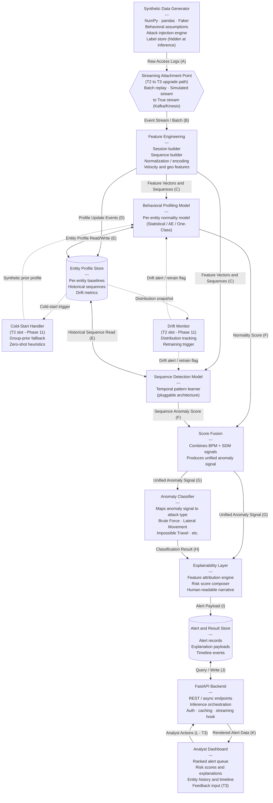

# ARCHITECTURE.md
# AI-Powered Behavioral Anomaly Detection — System Architecture

> **Status:** Phase 1 — Frozen Architecture Reference  
> **Version:** 1.0  
> **Last Updated:** 2026-07-25  
> **Scope:** Design only. No code, no schema, no API endpoint list. All future phases consume this document as their primary input.

---

## Table of Contents

1. [System Overview](#1-system-overview)
2. [Component Diagram](#2-component-diagram)
3. [Data Contracts at Each Boundary](#3-data-contracts-at-each-boundary)
4. [Tier Mapping](#4-tier-mapping)
5. [Streaming Position](#5-streaming-position)
6. [Cold-Start & Concept Drift Attachment Points](#6-cold-start--concept-drift-attachment-points)
7. [Alternatives Considered](#7-alternatives-considered)
8. [Judging-Criteria Traceability](#8-judging-criteria-traceability)
9. [Known Risks](#9-known-risks)

---

## 1. System Overview

The system is a modular, end-to-end behavioral anomaly detection pipeline designed for cybersecurity use cases where real intrusion logs are unavailable or restricted. A **Synthetic Data Generator** produces realistic per-entity access logs with injected, labeled attack patterns at controlled rates. Those raw logs flow through a **Feature Engineering** layer that builds session-level feature vectors and ordered event sequences, which are fed simultaneously into a **Behavioral Profiling Model** (learning what "normal" looks like per entity) and a **Sequence Detection Model** (learning temporal patterns of normal activity). When a new event deviates from either learned representation, a combined anomaly signal is passed to an **Anomaly Classifier** that assigns one of the defined attack categories, and in parallel to an **Explainability Layer** that generates human-readable feature attributions and a composite risk score. A **FastAPI Backend** mediates between the ML pipeline and the outside world, persisting results and serving them to an **Analyst Dashboard** — a browser-based interface providing a ranked alert queue, risk scores, contributing factors, and per-entity behavioral history. The architecture is implemented as a modular monolith during the hackathon, deliberately positioned so that the streaming inference path, cold-start handling, concept drift adaptation, and advanced analyst tooling can each be added as self-contained layers without restructuring the core pipeline.

---

## 2. Component Diagram

> **Reading the diagram:** Solid arrows are the live data path. Dashed arrows are the pluggable attachment points for Tier 2/3 capabilities. The `Streaming Attachment Point` node is the single location where the batch-to-stream upgrade occurs.

---

## 3. Data Contracts at Each Boundary

Each letter corresponds to an arrow in the Component Diagram. The **Producer** column names the component that is responsible for creating and validating the payload; the **Consumer** is responsible for schema validation on ingress.

| Boundary | Label | Producer | Consumer | Named Fields / Shape |
|----------|-------|----------|----------|----------------------|
| **A** | Raw Access Logs | Synthetic Data Generator | Streaming Attachment Point | `entity_id`, `entity_type`, `timestamp`, `source_ip`, `geo_location`, `resource_accessed`, `auth_method`, `session_duration`, `command_sequence[]`, `device_fingerprint`, `label` (hidden at inference) — one record per raw event |
| **B** | Event Stream / Batch | Streaming Attachment Point | Feature Engineering | Same schema as A minus `label`; delivered either as an in-memory batch DataFrame or as ordered single-event messages; includes a `delivery_mode` metadata tag (`batch` or `simulated_stream`) |
| **C** | Feature Vectors & Sequences | Feature Engineering | Behavioral Profiling Model, Sequence Detection Model | `entity_id`, `event_id`, `feature_vector` (normalized numeric array), `sequence_window` (ordered list of recent event feature vectors for this entity), `session_metadata` (geo-velocity delta, new-device flag, hour-of-day, etc.) |
| **D** | Profile Update Events | Feature Engineering | Entity Profile Store | `entity_id`, `event_id`, `timestamp`, `raw_feature_snapshot` — triggers an upsert of the entity's rolling baseline |
| **E** | Entity Profile Read/Write | Entity Profile Store | Behavioral Profiling Model, Sequence Detection Model | `entity_id`, `baseline_vector` (mean/variance or compact representation), `sequence_history[]` (last N sequences), `drift_metrics`, `cold_start_flag` |
| **F** | Normality / Sequence Anomaly Score | Behavioral Profiling Model, Sequence Detection Model (separately) | Score Fusion | `entity_id`, `event_id`, `model_id` (`bpm` or `sdm`), `anomaly_score` (float 0–1), `confidence`, `top_contributing_features[]` |
| **G** | Unified Anomaly Signal | Score Fusion | Anomaly Classifier, Explainability Layer | `entity_id`, `event_id`, `fused_score`, `is_anomaly` (bool, threshold-applied), `bpm_score`, `sdm_score`, `contributing_features[]` |
| **H** | Classification Result | Anomaly Classifier | Explainability Layer | `entity_id`, `event_id`, `predicted_class` (one of: `normal`, `brute_force`, `impossible_travel`, `credential_stuffing`, `lateral_movement`, `device_spoofing`, `low_and_slow_exfiltration`, `insider_drift`), `class_probabilities{}`, `classification_confidence` |
| **I** | Alert Payload | Explainability Layer | Alert & Result Store | `alert_id`, `entity_id`, `event_id`, `timestamp`, `risk_score` (0–100), `risk_tier` (`low`, `medium`, `high`, `critical`), `attack_class`, `human_readable_explanation` (string), `feature_attributions[]` (`{feature, direction, magnitude}`), `raw_event_snapshot` |
| **J** | Query / Write | FastAPI Backend (bidirectional) | Alert & Result Store | Alert records (read), timeline events (read), profile summaries (read), analyst feedback records (write — T3) |
| **K** | Rendered Alert Data | FastAPI Backend | Analyst Dashboard | `alerts[]` (paginated, sorted by `risk_score` desc), `entity_timeline[]`, `explanation_payload`, `entity_profile_summary` — delivered as JSON over REST |
| **L** | Analyst Actions (T3) | Analyst Dashboard | FastAPI Backend | `analyst_id`, `alert_id`, `decision` (`true_positive`, `false_positive`, `needs_review`), `notes` — feeds the human-feedback loop |

---

## 4. Tier Mapping

### Tier 1 — Must Have (Coherent End-to-End Demo)

These components must exist and be functionally connected for the system to be demonstrable. Tier 1 alone constitutes a complete submission.

| Component | T1 Capability Required |
|-----------|------------------------|
| **Synthetic Data Generator** | Generates synthetic logs per the prescribed schema; injects all 7 attack types at configurable rates; keeps labels hidden during inference |
| **Feature Engineering** | Produces session-level feature vectors and ordered sequence windows from raw event records |
| **Behavioral Profiling Model** | Learns per-entity normal behavior; outputs a normality score for each incoming event |
| **Sequence Detection Model** | Learns temporal behavioral patterns; outputs a sequence anomaly score |
| **Score Fusion** | Combines BPM and SDM scores into a single unified anomaly signal with a configurable threshold |
| **Anomaly Classifier** | Classifies the anomaly signal into one of the 8 defined categories |
| **Explainability Layer** | Generates a risk score (0–100), human-readable explanation string, and feature attribution list for every alert |
| **Entity Profile Store** | Persists per-entity baselines and recent sequence history; queried synchronously during inference |
| **Alert & Result Store** | Persists alert payloads for retrieval by the API layer |
| **FastAPI Backend** | Exposes inference and retrieval endpoints; orchestrates the ML pipeline on request |
| **Analyst Dashboard** | Displays ranked alert queue, risk scores, contributing factors, and basic entity history |

### Tier 2 — High Impact (Attaches to T1 Skeleton)

These capabilities enhance the submission against judging criteria but are additive — the T1 skeleton runs without them.

| Component / Capability | Where It Attaches |
|------------------------|-------------------|
| **Cold-Start Handler** | Attaches to Entity Profile Store; intercepts entities with `cold_start_flag=true` before BPM inference |
| **Drift Monitor** | Attaches to Entity Profile Store; reads distribution snapshots and emits retrain flags to BPM and SDM |
| **Simulated-Streaming Mode** | Upgrades the Streaming Attachment Point from batch replay to ordered, time-paced event delivery |
| **Analyst-Friendly Explanation Upgrades** | Enriches Explainability Layer output with narrative templates and MITRE ATT&CK mapping |
| **Entity History & Timeline View** | Extends Analyst Dashboard with a full per-entity activity timeline sourced from Alert & Result Store |
| **Model Evaluation Module** | Offline module that consumes held-out labeled data and reports precision/recall/F1/AUROC against classifier outputs; plugs in alongside the inference pipeline |
| **Modular Production-Quality Architecture** | Enforced separation of concerns, typed interfaces between modules, documented configuration |

### Tier 3 — Standout (Added Only After T1 + T2 Are Complete and Tested)

These features must not require restructuring any T1 or T2 component to be added.

| Component / Capability | Where It Attaches |
|------------------------|-------------------|
| **Human Feedback Loop** | Analyst Actions boundary (L) → FastAPI Backend → label store; retraining trigger |
| **Confidence Calibration** | Post-processing step inside Explainability Layer; no upstream changes required |
| **Model Monitoring & Retraining Pipeline** | Extends Drift Monitor with automated retraining job orchestration |
| **Interactive Attack Simulation** | New endpoint on FastAPI Backend; calls Synthetic Data Generator in controlled mode |
| **Advanced Visualizations** | Dashboard extension; new panels only, no changes to existing alert queue |
| **Docker / CI/CD** | Deployment wrapper around the existing FastAPI + pipeline; no internal changes |

---

## 5. Streaming Position

**Hackathon Build Mode: Simulated-Streaming (Tier 1 starts as Batch; Tier 2 upgrades to Simulated-Streaming).**

### Rationale

True streaming (e.g., Kafka, Kinesis, Faust) introduces infrastructure complexity — broker setup, consumer group management, offset tracking — that is disproportionate to hackathon timeline and team size constraints. Batch processing alone, however, would not demonstrate the "near real-time" evaluation criterion convincingly to judges.

The chosen position is **simulated-streaming**: the Synthetic Data Generator produces a complete dataset once, and the Streaming Attachment Point replays events in timestamp order with a configurable time-compression factor (e.g., 1 second of wall time = 1 minute of simulated time). This makes the demo visually real-time to judges without incurring broker infrastructure cost.

### Streaming Attachment Point

**Location:** Between the Synthetic Data Generator and Feature Engineering (boundary B in the Component Diagram).

This is the single location in the architecture where the delivery mode changes. Everything downstream — Feature Engineering, both ML models, Score Fusion, Classifier, Explainability, API, Dashboard — is stream-agnostic. It receives events one-at-a-time or in micro-batches regardless of how they were delivered.

### Upgrade Path to True Streaming (Phase 12)

To upgrade from simulated-streaming to true-streaming, only the Streaming Attachment Point node is replaced (e.g., with a Kafka consumer or Kinesis reader). No other component requires modification. The FastAPI Backend already exposes an async inference path that can receive pushed events from a stream processor instead of pulling from a batch file.

| Mode | When | What Changes |
|------|------|--------------|
| Batch | T1 baseline | SDG produces full dataset; FE processes all at once |
| Simulated-Streaming | T2 upgrade | SAP replays events in timestamp order with time-compression |
| True-Streaming | T3 / Phase 12 | SAP replaced with Kafka/Kinesis consumer; all downstream unchanged |

---

## 6. Cold-Start & Concept Drift Attachment Points

Detailed design of both strategies is deferred to **Phase 11**. The slots are named here so that the Entity Profile Store, Behavioral Profiling Model, and Sequence Detection Model can be designed with the correct interface contracts from the start.

### 6.1 Cold-Start Handler

**Attachment Point:** Entity Profile Store → Behavioral Profiling Model (boundary E, cold-start path)

**Trigger:** Any event where `cold_start_flag = true` in the entity profile read response — meaning the entity has fewer than a configurable minimum number of historical events.

**Slot Contract:** The Cold-Start Handler must produce a synthetic prior profile in the same format as a regular Entity Profile (boundary E) so that the BPM can proceed without modification. The handler is entirely pre-BPM; it intercepts the missing profile and substitutes a fallback. Possible Phase 11 strategies include group-prior profiles (aggregate baseline for the entity's peer group), zero-shot heuristics (rule-based initial thresholds), or a dedicated cold-start sub-model — the choice is deferred.

**Design Constraint:** The BPM must never receive a null profile; the Cold-Start Handler is the guard that guarantees this invariant.

### 6.2 Concept Drift Monitor

**Attachment Point:** Entity Profile Store → Behavioral Profiling Model and Sequence Detection Model (dashed edges in diagram)

**Trigger:** The Drift Monitor reads distribution snapshots from the Entity Profile Store on a configurable schedule (e.g., after every N events or T hours of simulated time) and computes a drift statistic (distribution divergence, reconstruction error trend, etc.).

**Slot Contract:** When drift is detected, the Drift Monitor emits a **drift event** containing `entity_id`, `drift_severity`, and `recommended_action` (`retrain`, `recalibrate_threshold`, or `notify_analyst`). The BPM and SDM must expose a recalibration interface that accepts this event. The specific drift detection algorithm and retraining strategy are Phase 11 decisions.

**Design Constraint:** The Drift Monitor must be a passive observer of the Entity Profile Store — it must not modify profiles directly. All profile updates remain the exclusive responsibility of Feature Engineering (boundary D).

---

## 7. Alternatives Considered

### Option A: Notebook-First Monolith

**Description:** The entire pipeline — data generation, feature engineering, modeling, explainability, and results — lives in a sequence of Jupyter notebooks. The "dashboard" is matplotlib/seaborn inline output. FastAPI is not used; results are saved to CSV.

**Why Rejected:**
- Fails the mandatory FastAPI backend requirement entirely.
- Notebooks are not demonstrable as an interactive system to judges; they cannot show near-real-time inference.
- Adding streaming, cold-start, or drift as later phases would require significant refactoring rather than clean attachment.
- Tier 2 and Tier 3 features become structurally impossible without a clean modular boundary.
- The explainability layer cannot be independently tested without re-running the entire notebook chain.

**What It Gets Right:** Fast initial prototyping for individual models. This approach is appropriate for ML experimentation phases (e.g., Phase 5–8 model selection) but not for the final integrated system.

---

### Option B: Full Microservices (Service-Per-Component)

**Description:** Each component — SDG, Feature Engineering, BPM, SDM, Classifier, Explainability, API, Dashboard — runs as an independent service with its own process, network address, and potentially its own container. Communication is via REST or a message bus between every pair.

**Why Rejected:**
- Disproportionate operational overhead for a hackathon timeline: service discovery, health checks, inter-service authentication, distributed tracing, and container orchestration consume time that should go to ML quality.
- Debugging is significantly harder: a broken inter-service call requires inspecting multiple logs across processes rather than a single stack trace.
- The judging criteria do not reward operational complexity; they reward detection quality, explainability, and analyst usability.
- A small team cannot maintain true microservice discipline under time pressure, and the result is a microservice architecture with monolith coupling — the worst of both worlds.

**What It Gets Right:** True production scalability and independent deployability. Docker Compose or Kubernetes deployments would score on "System Design and Scalability." This is reserved as a **Tier 3 wrapper** — a Docker Compose file can wrap the modular monolith at the end, giving judges the scalability narrative without incurring the development cost.

---

### Chosen Approach: Modular Monolith with Explicit Seams

**Description:** The entire pipeline runs in a single Python process (or a small number of tightly coupled processes during the hackathon), but every component is implemented as a self-contained module with a typed interface. The FastAPI backend is a thin orchestration layer on top of the pipeline modules. Components communicate through well-defined in-process function calls rather than network calls.

**Why This Is Better for This Project:**
1. **Hackathon speed:** No service infrastructure overhead. The full pipeline runs with a single `uvicorn` command.
2. **Debuggability:** A single stack trace spans the entire pipeline. Rapid iteration during the development phases is not bottlenecked by distributed system concerns.
3. **Judging criteria coverage:** The modular design produces a clean, readable codebase that demonstrates strong system design thinking to judges, even without microservice infrastructure.
4. **Clean upgrade path:** Because every component has a typed interface at its boundary, the architecture supports a future upgrade to microservices by replacing in-process calls with network calls — no ML logic changes required.
5. **Tier attachment compatibility:** Tier 2 and Tier 3 capabilities attach at named, documented seams (the Streaming Attachment Point, Cold-Start Handler slot, Drift Monitor slot, Feedback endpoint) without restructuring core inference logic.

---

## 8. Judging-Criteria Traceability

| Evaluation Criterion | Architectural Decision | Rationale |
|---------------------|----------------------|-----------|
| **Detection accuracy on imbalanced labels** | Separating BPM and SDM as independent models with Score Fusion | Allows each model to be independently calibrated for the class imbalance problem. BPM uses per-entity reconstruction error (naturally handling imbalance without requiring labeled negatives); SDM can be trained with sequence-level oversampling. Fusion allows threshold tuning without retraining either model. |
| **Correct anomaly-type classification** | Anomaly Classifier as a distinct component downstream of Score Fusion | Classification is architecturally decoupled from detection: the Classifier sees a clean, fused anomaly signal (boundary G) rather than raw features, making it easier to retrain the classifier independently as the attack taxonomy evolves. Multi-class classification on the fused signal also naturally handles class imbalance through targeted sampling strategies at the classification layer. |
| **False positive rate at analyst alert budget** | Explicit risk tier in Alert Payload (boundary I) + ranked alert queue in Dashboard | The architecture produces a continuous risk score rather than a binary flag, enabling the Analyst Dashboard to show only the top-N alerts. Score Fusion includes a configurable threshold that can be tuned against a held-out validation set — this tuning is a first-class architectural concern rather than a model hyperparameter buried inside a notebook. |
| **Explainability and analyst usability** | Explainability Layer as an independent component, not embedded inside the detector | Separating attribution logic from detection logic means the Explainability Layer can be improved, swapped, or extended (e.g., from SHAP to LIME to custom narrative templates) without touching the BPM or SDM. The Alert Payload (boundary I) is explicitly designed with `human_readable_explanation` and `feature_attributions[]` as first-class fields, guaranteeing the dashboard always receives structured, renderable explanations. |
| **Handling cold-start entities** | Named Cold-Start Handler slot with a defined contract (Section 6.1) | By naming this as an architectural slot today, the BPM interface contract already requires it to accept a profile — not a null — ensuring that the cold-start case is never an afterthought handled with an `if entity not found: skip` guard. The slot makes the cold-start strategy a replaceable module. |
| **Handling concept drift** | Named Drift Monitor slot with a passive-observer contract (Section 6.2) | The Entity Profile Store is designed to accumulate rolling distribution snapshots, making drift detection a pure read operation. Because the Drift Monitor cannot modify profiles directly, it cannot accidentally corrupt the behavioral baseline, mitigating a critical failure mode in production drift adaptation. |
| **System design and scalability (real-time streaming feasibility)** | Streaming Attachment Point as the single upgrade node (Section 5) | The entire downstream pipeline is stream-agnostic by design: it processes one event (or micro-batch) at a time regardless of delivery mode. This architectural decision allows judges to be shown a credible upgrade path to true streaming (Kafka/Kinesis) in a single diagram without requiring that infrastructure to be built during the hackathon. |
| **Report clarity** | ARCHITECTURE.md as a permanent, phase-consumable reference document | Producing a frozen architecture document before any code is written guarantees that all subsequent phase reports can reference a stable design. This demonstrates engineering discipline to judges reviewing the documentation deliverable. |

---

## 9. Known Risks

### Risk 1: Entity Profile Store Becomes a Scalability Bottleneck

**Description:** Every inference call performs synchronous reads and writes to the Entity Profile Store (boundary E). In the modular monolith, this store is likely an in-memory dictionary or a SQLite/embedded database. If the entity count or event volume exceeds the store's throughput, the entire pipeline stalls.

**Architectural Mitigation:** The Entity Profile Store is defined as a named component with a typed read/write interface (boundary E), not as a global dictionary scattered through the codebase. This means it can be replaced with a faster backend (Redis, DynamoDB) without touching BPM, SDM, or Feature Engineering code. The risk is deferred, not ignored — it becomes a Phase 11 operational concern, not a design debt.

---

### Risk 2: Score Fusion Hides Individual Model Failures

**Description:** If BPM or SDM is poorly calibrated (e.g., all scores cluster near 0.5), the fused score will appear reasonable but will be dominated by the better-calibrated model. This failure mode is invisible at the API layer.

**Architectural Mitigation:** The Alert Payload (boundary I) includes both `bpm_score` and `sdm_score` as separate fields alongside `fused_score`. The Model Evaluation Module (Tier 2) is designed to evaluate each model independently, making calibration failures visible before they reach the dashboard. Individual model observability is an architectural first-class concern, not a debugging afterthought.

---

### Risk 3: Label Leakage from Generator to Inference Path

**Description:** The Synthetic Data Generator knows the ground-truth label for every event. If any downstream component inadvertently receives the label field during inference, model evaluation results will be inflated and meaningless.

**Architectural Mitigation:** The label is not carried past boundary A in the inference path. The Streaming Attachment Point is architecturally responsible for stripping the label field before delivering events to Feature Engineering (boundary B). This single enforcement point means no downstream component ever needs label-stripping logic. The labels are retained in a separate label store used exclusively by the Model Evaluation Module.

---

### Risk 4: Explainability Layer Becomes a Performance Bottleneck

**Description:** Feature attribution methods (SHAP, LIME, gradient-based) can be significantly slower than inference, especially for sequence models. If attribution is computed synchronously on the inference path, the end-to-end latency may be unacceptably high for the simulated-streaming demo.

**Architectural Mitigation:** The Explainability Layer is an independent component receiving a completed anomaly signal (boundary G) — it is architecturally downstream of all detection logic and can be made asynchronous without restructuring the detection path. In the T2 streaming mode, explanations can be computed in a separate thread or process and written to the Alert & Result Store asynchronously; the Dashboard retrieves them independently. The architectural seam at boundary G is the enabler of this decoupling.

---

### Risk 5: Cold-Start Handler Introduces Systematic Bias

**Description:** If the Cold-Start Handler provides group-prior profiles that are systematically too permissive or too strict, every new entity will start with a biased anomaly threshold. This bias is architectural: it lives in the profile, not in the model weights, so it cannot be corrected by retraining alone.

**Architectural Mitigation:** The Cold-Start Handler slot (Section 6.1) is defined with a contract that includes `cold_start_flag = true` in the profile it produces. The BPM must propagate this flag through to the Alert Payload, allowing the Analyst Dashboard to visually distinguish alerts from cold-start entities (lower confidence baseline). This transparency prevents analysts from treating cold-start alerts with the same confidence as alerts from fully profiled entities. Full mitigation strategy is Phase 11.

---

### Risk 6: Concept Drift Adaptation Corrupts Stable Profiles

**Description:** If the Drift Monitor incorrectly classifies an ongoing attack as legitimate behavioral drift (the "Insider Drift" edge case in the problem statement), triggering profile adaptation during an intrusion would permanently incorporate the malicious behavior into the entity's baseline, suppressing future alerts for the same attack pattern.

**Architectural Mitigation:** The Drift Monitor is defined as a passive observer that cannot write to the Entity Profile Store (Section 6.2). Profile updates flow exclusively through Feature Engineering (boundary D). Any drift-triggered retraining must create a new model or a new profile version — it cannot silently overwrite the existing baseline in place. This versioning invariant is an architectural constraint to be enforced in Phase 11's design. Additionally, the Alert & Result Store preserves a full alert history, enabling post-hoc detection of adaptation abuse.

---

*End of ARCHITECTURE.md — Phase 1 output. This document is frozen. Amendments require a versioned change record.*
